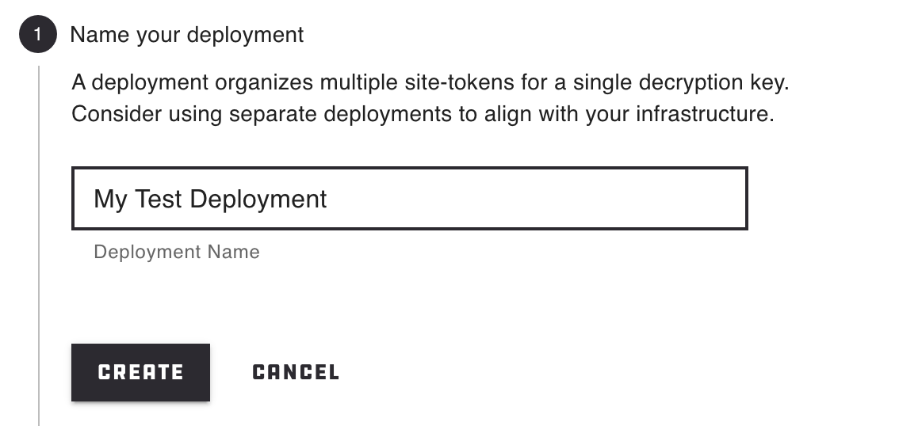
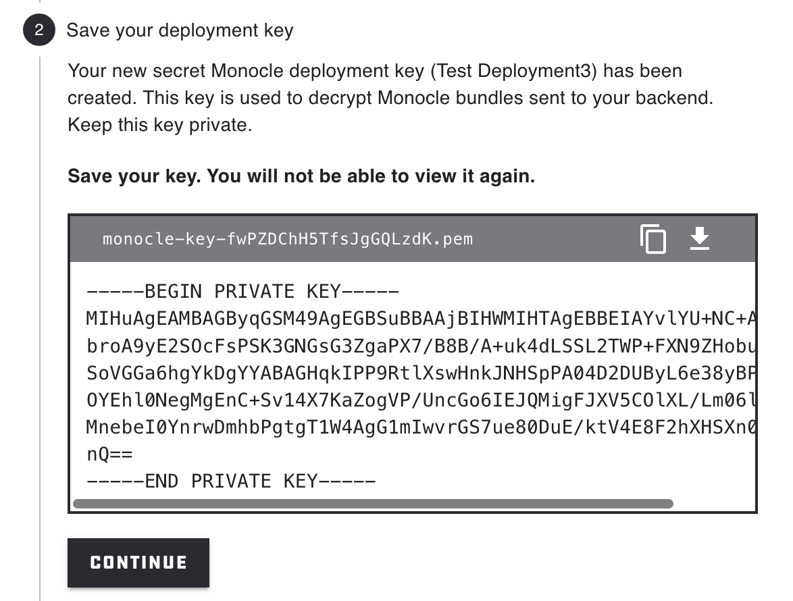
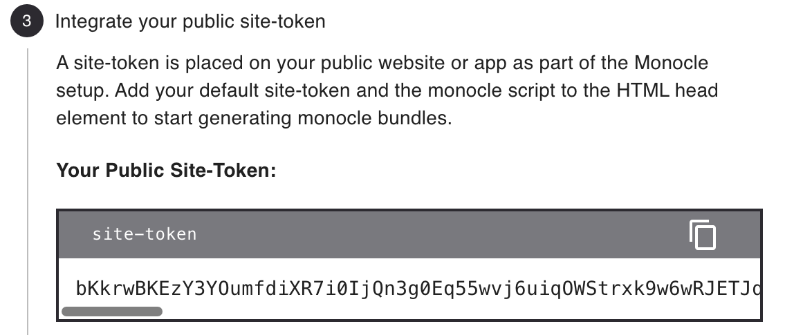
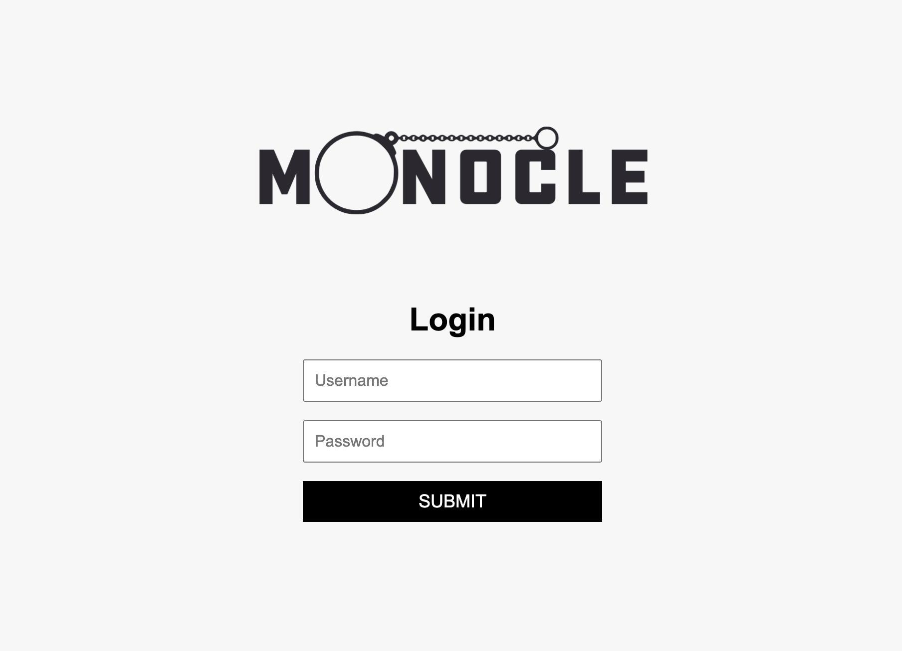
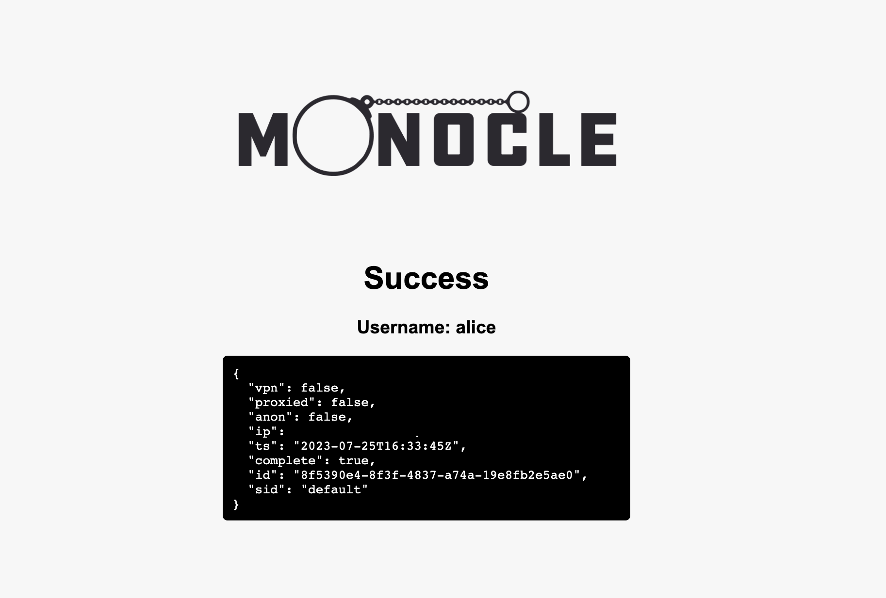
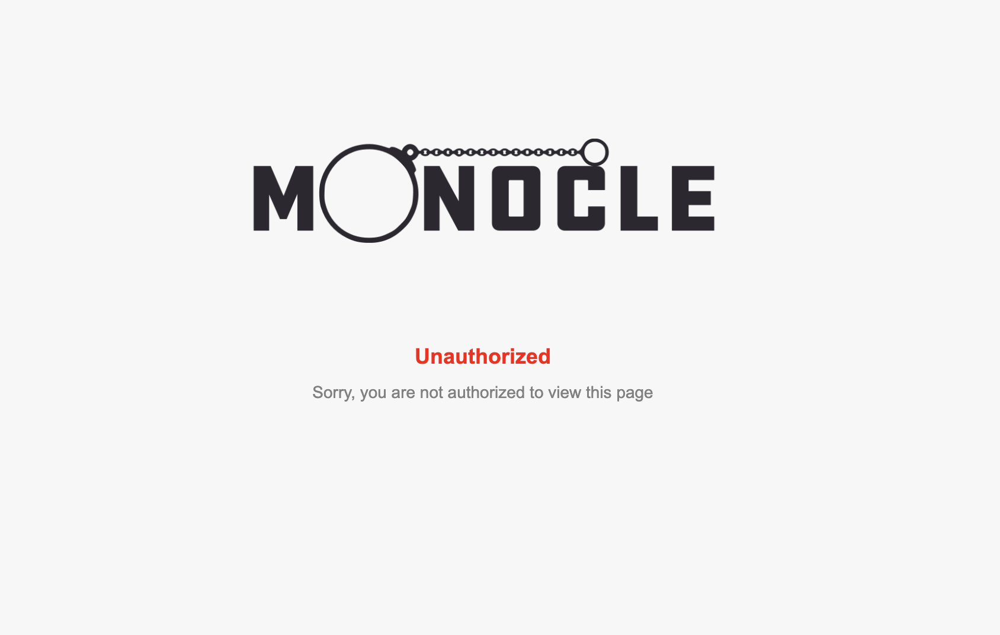

# Monocle Example Go
A simple Go backend example to get you started with monocle. It includes a Go web server and some basic HTML with a login form protected by monocle.

## I don't want to RTFM just get me started immediately
1. Create a test directory
   ```
   mkdir /tmp/monocle-test && cd /tmp/monocle-test
   ```
1. Create a free Spur account - [Spur Sign Up](https://spur.us/app/start/create-account)
1. Sign in to your account
1. Navigate to your monocle settings - [Monocle Management](https://spur.us/app/monocle)
1. Create a deployment

   

1. Click the download button to save your key or create a file and copy the pem encoded key data into it.

   

1. Move your downloaded key to your test directory and name it `monocle-key.pem`
1. Save your site token to a file called `site-token.txt`

   

1. Create a .env file with the following content:
   ```
   PORT=8080
   PRIVATE_KEY=
   TOKEN=
   USERNAME=alice
   PASSWORD=alice
   STRICTNESS_LEVEL=0
   ```
1. Setup your private key for embedding as an env variable. (Mac OS example)
    ```
    cat monocle-key.pem|base64|pbcopy
    ```
1. Use the base64 encoded key in your .env file
   ```
   # Open .env in your favorite editor and paste your base64 encoded key from the clipboard into the PRIVATE_KEY variable
   PRIVATE_KEY=dsaklfjaksljdfklajdsfkldasjfkdlasjfdsaklsjfklasdjfkdsa...
   ```
1. Copy the site token to your clipboard
   ```
   cat site-token.txt|pbcopy
   ```
1. Use the site token in your .env file
   ```
   # Open .env in your favorite editor and paste your site token from the clipboard into the TOKEN variable
   TOKEN=dsaklfjaksljdfklajdsfkldasjfkdlasjfdsaklsjfklasdjfkdsa...
   ```
1. Run the example with docker
   ```
   # Pull the latest image
   docker pull jjunqueiraspur/monocle-example-go:latest

   # Run the example
   docker run --env-file .env -p 8080:8080 jjunqueiraspur/monocle-example-go:latest
   ```


Open https://localhost:8080

## What is monocle?
Monocle is a passive zero-trust captcha that provides your web application with data to assess the risk of an individual user connection. Monocle is the only tool of its class capable of detecting residential proxies.

For additional documentation please visit the monocle product page [Monocle](https://spur.us/products/monocle/)

For additional information on integration visit the monocle documentation page [Monocle Integration](https://docs.spur.us/#/monocle?id=monocle)

## How does monocle work?
You add a small JavaScript stub to your website or application. On a user-action, such as a form submission, you get an assessment (a.k.a threat bundle) that you can interpret on your backend to take action.

For additional documentation please visit the monocle product page [Monocle](https://spur.us/products/monocle/)

For additional information on integration visit the monocle documentation page [Monocle Integration](https://docs.spur.us/#/monocle?id=monocle)

### Example Threat Bundles

#### VPN
```
{
  "vpn": true,
  "proxied": false,
  "anon": true,
  "ip": "XXX.XXX.XXX.XXX",
  "ts": "2023-07-28T13:22:07Z",
  "complete": true,
  "id": "7a09361c-6acc-4781-9526-c8998a88b539",
  "sid": "default"
}
```

#### Proxy

```
{
  "vpn": false,
  "proxied": true,
  "anon": true,
  "ip": "XXX.XXX.XXX.XXX",
  "ts": "2023-07-28T13:22:07Z",
  "complete": true,
  "id": "7a09361c-6acc-4781-9526-c8998a88b539",
  "sid": "default"
}
```

### Clean

```
{
  "vpn": false,
  "proxied": false,
  "anon": false,
  "ip": "XXX.XXX.XXX.XXX",
  "ts": "2023-07-28T13:22:07Z",
  "complete": true,
  "id": "7a09361c-6acc-4781-9526-c8998a88b539",
  "sid": "default"
}
```

## How do I decide what to block?

The Monocle Community Edition allows for the tracking of three distinct signals: VPN, proxied, and anonymous traffic. If you upgrade to the Monocle Enterprise Edition, your bundle will include an extra 'service' field. This added feature provides the means to more intricately block specific services. Using these indicators together, you can effectively deter undesired traffic to your website.

### Strictness Levels
This repository defines 4 strictness levels exposed as an environment variable to configure blocking. In addition to basic checks such as making sure the bundle is complete and isn't stale, it also checks various combinations of vpn, proxied, and anon that should be blocked.

Stricness Level Definitions:
```
0 => Log Only
1 => Block Proxies
2 => Block VPNs
3 => Block VPNs and Proxies
```


See below for some example code on customizing the decision making process if you would like to do it yourself.

### No VPNs
```go
// Utilize the returned bundle to block anonymous vpns
if bundle.VPN && bundle.Anon {
    log.Printf("Blocking request for username %s with bundle %s", username, monocleBundle)
    w.WriteHeader(http.StatusUnauthorized)
    w.Write([]byte(unauthorizedHTML)) //nolint
    return
}
```

### No Proxies
```go
// Utilize the returned bundle to block anonymous proxies
if bundle.Proxied && bundle.Anon {
    log.Printf("Blocking request for username %s with bundle %s", username, monocleBundle)
    w.WriteHeader(http.StatusUnauthorized)
    w.Write([]byte(unauthorizedHTML)) //nolint
    return
}
```

### No VPNs or Proxies
```go
// Utilize the returned bundle to block anonymous vpns and proxies
if (bundle.VPN || bundle.Proxied) && bundle.Anon {
    log.Printf("Blocking request for username %s with bundle %s", username, monocleBundle)
    w.WriteHeader(http.StatusUnauthorized)
    w.Write([]byte(unauthorizedHTML)) //nolint
    return
}
```

## Getting started

### Sign up for monocle
Before you can use this example you need a monocle private key and token.

1. Create a free Spur account - [Spur Sign Up](https://spur.us/app/start/create-account)
2. Sign in to your account
3. Navigate to your monocle settings - [Monocle Management](https://spur.us/app/monocle)
4. Create a deployment
5. Save your deployment key and site token
6. Setup your private key for embedding as an env variable. (Mac OS example)
    ```
    cat monocle-key.pem|base64|pbcopy
    ```
7. Use the base64 encoded key in your .env file.

### Dependencies
You need to have Go, Docker, and make installed

### Environment
For local testing you need to setup an env file.

Setup an environment file called .env in the root of this directory. It should look like the following:
```
PORT=8080
PRIVATE_KEY={YOUR_PRIVATE_KEY_HERE}
TOKEN={YOUR_TOKEN}
USERNAME=alice
PASSWORD=alice
STRICTNESS_LEVEL=0
```

You can change the username and password to anything you want. It is only for testing purposes.

## Running
### Local
You can run the server locally by executing `make run`. This will build a binary based on your local system architecture and start the server.

Navigate to http://localhost:8080

#### Form/Landing Page
If the server is running correctly you should see the landing/login form page with the username and password field. Monocle will seamlessly load in the background.



#### Success Page

If you provde the correct username and password you will get to see the decrypted bundle in its JSON form.



#### Unauthorized Page
If you do not provide the correct password or if you try to access the page via an anonymous vpn or proxy you will see the unauthorized page.



### Building a container
```
# Build the image with docker
docker build -t monocle-example-go .

# Run the image using the environment file
docker run --env-file .env -p 8080:8080 monocle-example-go
```
